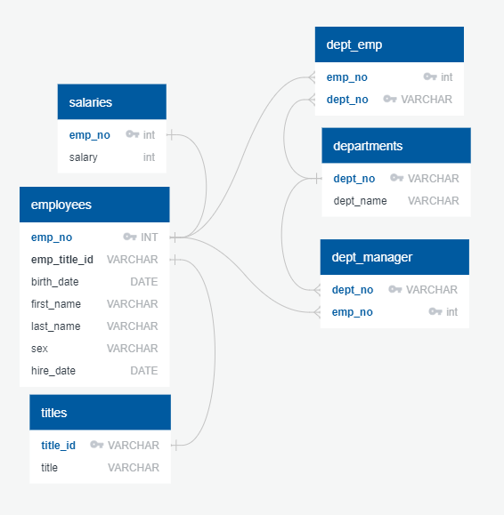

# sql_challenge
In this practice, six CSV files were imported into a SQL database "Employee_db" followed by data modeling, data engineering, and data analysis. 

1. Data Modeling 
An Entity Relationship Diagram (ERD) of tables based on the CSV files was sketched by using QuickDBD. An image file of the ERD is included.

2. Data Engineering 
A table schema was created for each of the six CSV files including specified data types, primary keys, foreign keys. The CSV files were imported to corresponding SQL table. 

3. Data Analysis

  (1)	Listed the employee number, last name, first name, sex, and salary of each employee.

  (2)	Listed the first name, last name, and hire date for the employees who were hired in 1986.

  (3)	Listed the manager of each department along with their department number, department name, employee number, last name, and first name.

  (4)	Listed the department number for each employee along with that employee’s employee number, last name, first name, and department name.

  (5)	Listed first name, last name, and sex of each employee whose first name is Hercules and whose last name begins with the letter B.

  (6)	Listed each employee in the Sales department, including their employee number, last name, and first name.

  (7)	Listed each employee in the Sales and Development departments, including their employee number, last name, first name, and department name.

  (8)	Listed the frequency counts, in descending order, of all the employee last names (that is, how many employees share each last name).

I would like to give my thanks to TAs and tutors for the assistance and resources on resolving the script issue. 
